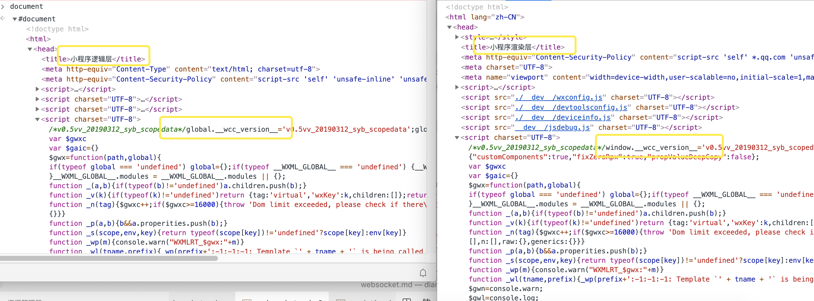

# WEPT学习笔记

WEPT 是一个微信小程序实时开发环境，它的目标是为小程序开发提供高效、稳定、友好、无限制的运行环境。

项目后台使用 node 提供服务完全动态生成小程序，前端实现了 view 层、service 层和控制层之间的相关通讯逻辑。

支持iOS Android Mac, Window 以及 Linux 

## 安装 & 使用方法
### Web

    npm i wept -g

如安装较慢，可使用 [cnpm](http://npm.taobao.org/)

到小程序项目根目录下执行命令：

    cd case && wept

使用 Chrome 访问 `http://localhost:3000` 打开开发者工具后启用移动页面调试模式（Mac 下快捷键为 `⌘ ⇧ M`）

# 小程序架构

## 小程序与普通网页开发的区别

网页开发渲染线程和脚本线程是互斥的，这也是为什么长时间的脚本运行可能会导致页面失去响应，而在小程序中，二者是分开的，分别运行在不同的线程中。

网页开发者可以使用到各种浏览器暴露出来的 DOM API，进行 DOM 选中和操作。而如上文所述，小程序的逻辑层和渲染层是分开的，逻辑层运行在 JSCore 中，并没有一个完整浏览器对象，因而缺少相关的DOM API和BOM API。这一区别导致了前端开发非常熟悉的一些库，例如 jQuery、 Zepto 等，在小程序中是无法运行的。同时 JSCore 的环境同 NodeJS 环境也是不尽相同，所以一些 NPM 的包在小程序中也是无法运行的。

网页开发者需要面对的环境是各式各样的浏览器，PC 端需要面对 IE、Chrome、QQ浏览器等，在移动端需要面对Safari、Chrome以及 iOS、Android 系统中的各式 WebView 。而小程序开发过程中需要面对的是两大操作系统 iOS 和 Android 的微信客户端，以及用于辅助开发的小程序开发者工具，小程序中三大运行环境也是有所区别的，如表1-1所示。

表1-1 小程序的运行环境

| **运行环境**     | **逻辑层**     | **渲染层**       |
| :--------------- | :------------- | :--------------- |
| iOS              | JavaScriptCore | WKWebView        |
| 安卓             | V8             | chromium定制内核 |
| 小程序开发者工具 | NWJS           | Chrome WebView   |

不同运行环境下，脚本执行环境以及用于组件渲染的环境是不同的，性能表现也存在差异：

- 在 iOS、iPadOS 和 Mac OS 上，小程序逻辑层的 JavaScript 代码运行在 JavaScriptCore 中，视图层是由 WKWebView 来渲染的，环境有 iOS 14、iPad OS 14、Mac OS 11.4 等；
- 在 Android 上，小程序逻辑层的 JavaScript 代码运行在 [V8](https://developers.google.com/v8/) 中，视图层是由基于 Mobile Chromium 内核的微信自研 XWeb 引擎来渲染的；
- 在 Windows 上，小程序逻辑层 JavaScript 和视图层都是用 Chromium 内核；
- 在 开发工具上，小程序逻辑层的 JavaScript 代码是运行在 [NW.js](https://nwjs.io/) 中，视图层是由 Chromium Webview 来渲染的。

> JavaScriptCore 无法开启 JIT 编译 (Just-In-Time Compiler)，同等条件下的运行性能要明显低于其他平台。

### 平台差异

尽管各运行环境是十分相似的，但是还是有些许区别：

- `JavaScript` 语法和 API 支持不一致：语法上开发者可以通过开启 `ES6` 转 `ES5` 的功能来规避（[详情](https://developers.weixin.qq.com/miniprogram/dev/devtools/codecompile.html#es6-转-es5)）；此外，小程序基础库内置了必要的Polyfill，来弥补API的差异（[详情](https://developers.weixin.qq.com/miniprogram/dev/framework/runtime/js-support.html))。
- `WXSS` 渲染表现不一致：尽管可以通过开启[样式补全](https://developers.weixin.qq.com/miniprogram/dev/devtools/codecompile.html#样式补全)来规避大部分的问题，还是建议开发者需要在各端分别检查小程序的真实表现。

**开发者工具仅供调试使用，最终的表现以客户端为准。**

## 渲染层和逻辑层

小程序的运行环境分成渲染层和逻辑层，其中 WXML 模板和 WXSS 样式工作在渲染层，JS 脚本工作在逻辑层。

小程序的渲染层和逻辑层分别由2个线程管理：渲染层的界面使用了WebView 进行渲染；逻辑层采用JsCore线程运行JS脚本。一个小程序存在多个界面，所以渲染层存在多个WebView线程，这两个线程的通信会经由微信客户端（下文中也会采用Native来代指微信客户端）做中转，逻辑层发送网络请求也经由Native转发，小程序的通信模型下图所示。


# 逆向

通过以下命令，就可验证渲染层界面使用WebView 进行渲染。

```js
document.getElementsByTagName('webview')
```


共有5个WebView，具体webview页面内容又可通过如下命令查看：

```js
document.getElementsByTagName('webview')[0].showDevTools(true,null)
```


上面的webview可以找到对应的页面层的结构，那么appservice要怎么找到呢？

其实最简单的我们直接在首页里面的控制台打document就可以直接看到展示的逻辑层代码


**注意点在微信小游戏里面微信重写了window和document对象 所以不能直接按照我们平常操作页面那样使用**

接下面我们看下微信小程序的基础库库文件

方法是我们在首页控制台里面输入

```
openVendor()
```

我们可以看到弹出的文件系统


这里面对应的就是你所选择的调试基础库


- .wxvpkg文件就是每个基础库版本的包我们，解压这个包我们可以看到他的组成
- wcc 可执行程序，用于将 wxml 转为 view 模块使用的js
- wcsc 可执行程序，用于将 wxss 转为 view 模块使用的 css

wxvpkg包里面这个基础库文件的WAWebview.js和WAService.js

对应这两个webview里面的js引用你可以仔细观察下

.wxvpkg文件解包后的格式


**对于wcc和wcsc源码现在没必要去研究他，但我们可以通过脚本劫持方法可以看到他运行了什么命令操作**


### 从上面这个图就可以看出下面这个图里面我们可以认知到一些信息

- 首次加载的时候wcc执行了-ds -d - xc...和-ds -d - cc...结构的命令可以看到微信首次把所有.wxml都执行了
- 可以看到参数里面有个数字其实他对应的有几种.wxml文件形式向只存在.wxml和自定义组件等一些格式他是没计算在内的
- -xc -cc 其实对应就是下面图两个逻辑层和渲染层里面的js方式

[](https://user-images.githubusercontent.com/40260484/68039364-ed0a0a00-fd06-11e9-980d-c3f7a660674f.png)

- **我发现当我们修改一个.wxml里面一点改动的时候，微信又会全部从新编译执行这些命令很耗时这点其实可以改进的**
- **另一个微信开发者工具感觉做的不友好的地方是大于 500KB 的 javascript 文件不做给你做es6 转换和压缩，就算你设置了微信也不会给你转，可以在source里面的资源可以看出**

### wcc执行的命令最终生成的就是逻辑层和渲染层的$gwxc()方法里面的js代码，大家可以自己手动测试下就会发现

[](https://user-images.githubusercontent.com/40260484/68039366-ee3b3700-fd06-11e9-944c-a099d1908634.png)

### wxss生成的主要是渲染层eval()这一坨代码

[](https://user-images.githubusercontent.com/40260484/68039368-ef6c6400-fd06-11e9-99d6-73569ec420cd.png)

#### WAService.js文件

这个文件算是微信小程序基础库文件里面很核心的文件了，所以微信对它的保护应该很到位了，微信通过了压缩 编译 打包后生成的一坨这个js文件(如下图)


WAService.js文件分析可以看出大致有 ： WeixinJSBridge、 NativeBuffer、 wxConsole、 WeixinWorker、 Reporter、 wx、 exparser、 **virtualDOM**、 **appServiceEngine** 等对象组成的
