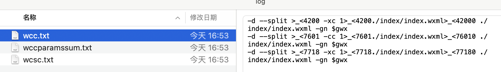

# WEPT学习笔记

WEPT 是一个微信小程序实时开发环境，它的目标是为小程序开发提供高效、稳定、友好、无限制的运行环境。

项目后台使用 node 提供服务完全动态生成小程序，前端实现了 view 层、service 层和控制层之间的相关通讯逻辑。

支持iOS Android Mac, Window 以及 Linux 

## 安装 & 使用方法
### Web

    npm i wept -g

如安装较慢，可使用 [cnpm](http://npm.taobao.org/)

到小程序项目根目录下执行命令：

    cd case && wept

使用 Chrome 访问 `http://localhost:3000` 打开开发者工具后启用移动页面调试模式（Mac 下快捷键为 `⌘ ⇧ M`）

# 小程序架构

## 小程序与普通网页开发的区别

网页开发渲染线程和脚本线程是互斥的，这也是为什么长时间的脚本运行可能会导致页面失去响应，而在小程序中，二者是分开的，分别运行在不同的线程中。

网页开发者可以使用到各种浏览器暴露出来的 DOM API，进行 DOM 选中和操作。而如上文所述，小程序的逻辑层和渲染层是分开的，逻辑层运行在 JSCore 中，并没有一个完整浏览器对象，因而缺少相关的DOM API和BOM API。这一区别导致了前端开发非常熟悉的一些库，例如 jQuery、 Zepto 等，在小程序中是无法运行的。同时 JSCore 的环境同 NodeJS 环境也是不尽相同，所以一些 NPM 的包在小程序中也是无法运行的。

网页开发者需要面对的环境是各式各样的浏览器，PC 端需要面对 IE、Chrome、QQ浏览器等，在移动端需要面对Safari、Chrome以及 iOS、Android 系统中的各式 WebView 。而小程序开发过程中需要面对的是两大操作系统 iOS 和 Android 的微信客户端，以及用于辅助开发的小程序开发者工具，小程序中三大运行环境也是有所区别的，如表1-1所示。

表1-1 小程序的运行环境

| **运行环境**     | **逻辑层**     | **渲染层**       |
| :--------------- | :------------- | :--------------- |
| iOS              | JavaScriptCore | WKWebView        |
| 安卓             | V8             | chromium定制内核 |
| 小程序开发者工具 | NWJS           | Chrome WebView   |

不同运行环境下，脚本执行环境以及用于组件渲染的环境是不同的，性能表现也存在差异：

- 在 iOS、iPadOS 和 Mac OS 上，小程序逻辑层的 JavaScript 代码运行在 JavaScriptCore 中，视图层是由 WKWebView 来渲染的，环境有 iOS 14、iPad OS 14、Mac OS 11.4 等；
- 在 Android 上，小程序逻辑层的 JavaScript 代码运行在 [V8](https://developers.google.com/v8/) 中，视图层是由基于 Mobile Chromium 内核的微信自研 XWeb 引擎来渲染的；
- 在 Windows 上，小程序逻辑层 JavaScript 和视图层都是用 Chromium 内核；
- 在 开发工具上，小程序逻辑层的 JavaScript 代码是运行在 [NW.js](https://nwjs.io/) 中，视图层是由 Chromium Webview 来渲染的。

> JavaScriptCore 无法开启 JIT 编译 (Just-In-Time Compiler)，同等条件下的运行性能要明显低于其他平台。

### 平台差异

尽管各运行环境是十分相似的，但是还是有些许区别：

- `JavaScript` 语法和 API 支持不一致：语法上开发者可以通过开启 `ES6` 转 `ES5` 的功能来规避（[详情](https://developers.weixin.qq.com/miniprogram/dev/devtools/codecompile.html#es6-转-es5)）；此外，小程序基础库内置了必要的Polyfill，来弥补API的差异（[详情](https://developers.weixin.qq.com/miniprogram/dev/framework/runtime/js-support.html))。
- `WXSS` 渲染表现不一致：尽管可以通过开启[样式补全](https://developers.weixin.qq.com/miniprogram/dev/devtools/codecompile.html#样式补全)来规避大部分的问题，还是建议开发者需要在各端分别检查小程序的真实表现。

**开发者工具仅供调试使用，最终的表现以客户端为准。**

## 渲染层和逻辑层

小程序的运行环境分成渲染层和逻辑层，其中 WXML 模板和 WXSS 样式工作在渲染层，JS 脚本工作在逻辑层。

小程序的渲染层和逻辑层分别由2个线程管理：渲染层的界面使用了WebView 进行渲染；逻辑层采用JsCore线程运行JS脚本。一个小程序存在多个界面，所以渲染层存在多个WebView线程，这两个线程的通信会经由微信客户端（下文中也会采用Native来代指微信客户端）做中转，逻辑层发送网络请求也经由Native转发，小程序的通信模型下图所示。


# 逆向

通过以下命令，就可验证渲染层界面使用WebView 进行渲染。

```js
document.getElementsByTagName('webview')
```


共有5个WebView，具体webview页面内容又可通过如下命令查看：

```js
document.getElementsByTagName('webview')[0].showDevTools(true,null)
```


并且经过验证


webview最多十个，正如官方文档里描述


小程序中页面栈最多十层。

上面的webview可以找到对应的页面层的结构，那么appservice要怎么找到呢？

其实最简单的我们直接在首页里面的控制台打document就可以直接看到展示的逻辑层代码


**注意点在微信小游戏里面微信重写了window和document对象 所以不能直接按照我们平常操作页面那样使用**

接下面我们看下微信小程序的基础库库文件

方法是我们在首页控制台里面输入

```
openVendor()
```

我们可以看到弹出的文件系统


这里面对应的就是你所选择的调试基础库


- .wxvpkg文件就是每个基础库版本的包我们，解压这个包我们可以看到他的组成
- wcc 可执行程序，用于将 wxml 转为 view 模块使用的js
- wcsc 可执行程序，用于将 wxss 转为 view 模块使用的 css

wxvpkg包里面这个基础库文件的WAWebview.js和WAService.js

对应这两个webview里面的js引用你可以仔细观察下

.wxvpkg文件解包后的格式


**对于wcc和wcsc源码现在没必要去研究他，但我们可以通过脚本劫持方法可以看到他运行了什么命令操作**




### 从上面这个图就可以看出下面这个图里面我们可以认知到一些信息

- 首次加载的时候wcc执行了-ds -d - xc...和-ds -d - cc...结构的命令可以看到微信首次把所有.wxml都执行了
- 可以看到参数里面有个数字其实他对应的有几种.wxml文件形式向只存在.wxml和自定义组件等一些格式他是没计算在内的
- -xc -cc 其实对应就是下面图两个逻辑层和渲染层里面的js方式

[](https://user-images.githubusercontent.com/40260484/68039364-ed0a0a00-fd06-11e9-980d-c3f7a660674f.png)

- **我发现当我们修改一个.wxml里面一点改动的时候，微信又会全部从新编译执行这些命令很耗时这点其实可以改进的**
- **另一个微信开发者工具感觉做的不友好的地方是大于 500KB 的 javascript 文件不做给你做es6 转换和压缩，就算你设置了微信也不会给你转，可以在source里面的资源可以看出**

### wcc执行的命令最终生成的就是逻辑层和渲染层的$gwxc()方法里面的js代码，大家可以自己手动测试下就会发现

[](https://user-images.githubusercontent.com/40260484/68039366-ee3b3700-fd06-11e9-944c-a099d1908634.png)

### wxss生成的主要是渲染层eval()这一坨代码

[](https://user-images.githubusercontent.com/40260484/68039368-ef6c6400-fd06-11e9-99d6-73569ec420cd.png)

#### WAService.js文件

这个文件算是微信小程序基础库文件里面很核心的文件了，所以微信对它的保护应该很到位了，微信通过了压缩 编译 打包后生成的一坨这个js文件(如下图)


WAService.js文件分析可以看出大致有 ： WeixinJSBridge、 NativeBuffer、 wxConsole、 WeixinWorker、 Reporter、 wx、 exparser、 **virtualDOM**、 **appServiceEngine** 等对象组成的

# WEPT 

### Dependencies

1. babel-core: ^6.22.1

   Babel 是一个 JavaScript 编译器，使您能够在代码中使用最新的 ECMAScript 功能。`babel-core`是巴别塔的中心部分。

2. babel-preset-es2015: ^6.22.0

   将 ECMAScript 2015 (ES6) 代码转换为向后兼容的 JavaScript 版本所需的 Babel 插件。

3. babel-runtime: ^6.22.0

   Babel 运行时包含对生成器和 async/await 等功能在转译代码中使用时所需的运行时支持。

4. boxen: ^1.0.0

   Boxen 是一个为控制台输出创建具有可选边框和样式的文本框的模块。

5. chalk: ^1.1.3

   Chalk 是一个用于在控制台中使用颜色设置文本样式的库。

6. chokidar: ^1.6.1

    Chokidar 是 Node.js 的文件监视实用程序。它允许您的应用程序对文件系统更改做出反应。

7. commander: ^2.9.0

   Commander 是 Node.js 的命令行界面库，可帮助您创建命令行工具。

8. [concat-with-sourcemaps: ^1.0.4](https://www.npmjs.com/package/concat-with-sourcemaps)

   用于连接文件和生成源映射的 NPM 模块。

   ```json
   var concat = new Concat(true, 'all.js', '\n');
   concat.add(null, "// (c) John Doe");
   concat.add('file1.js', file1Content);
   concat.add('file2.js', file2Content, file2SourceMap);
    
   var concatenatedContent = concat.content;
   var sourceMapForContent = concat.sourceMap;
   ```

   

9. [convert-source-map: ^1.3.0](https://www.npmjs.com/package/convert-source-map)

   将源映射从不同格式转换为不同格式，并允许添加/更改属性。

   ```javascript
   var convert = require('convert-source-map');
   
   var json = convert
     .fromComment('//# sourceMappingURL=data:application/json;base64,eyJ2ZXJzaW9uIjozLCJmaWxlIjoiYnVpbGQvZm9vLm1pbi5qcyIsInNvdXJjZXMiOlsic3JjL2Zvby5qcyJdLCJuYW1lcyI6W10sIm1hcHBpbmdzIjoiQUFBQSIsInNvdXJjZVJvb3QiOiIvIn0=')
     .toJSON();
   
   var modified = convert
     .fromComment('//# sourceMappingURL=data:application/json;base64,eyJ2ZXJzaW9uIjozLCJmaWxlIjoiYnVpbGQvZm9vLm1pbi5qcyIsInNvdXJjZXMiOlsic3JjL2Zvby5qcyJdLCJuYW1lcyI6W10sIm1hcHBpbmdzIjoiQUFBQSIsInNvdXJjZVJvb3QiOiIvIn0=')
     .setProperty('sources', [ 'SRC/FOO.JS' ])
     .toJSON();
   
   console.log(json);
   console.log(modified);
   ```

   ```json
   {"version":3,"file":"build/foo.min.js","sources":["src/foo.js"],"names":[],"mappings":"AAAA","sourceRoot":"/"}
   {"version":3,"file":"build/foo.min.js","sources":["SRC/FOO.JS"],"names":[],"mappings":"AAAA","sourceRoot":"/"}
   ```

   

10. [debounce: ^1.0.0](https://www.npmjs.com/package/debounce)

    延迟函数调用，直到上次调用后经过设定的时间

    ```javascript
    import debounce from 'debounce';
    
    function resize() {
    	console.log('height', window.innerHeight);
    	console.log('width', window.innerWidth);
    }
    
    window.onresize = debounce(resize, 200);
    ```

11. ejs: ^3.1.5

    EJS 是一种简单的模板语言，可让您使用纯 JavaScript 生成 HTML 标记。

12. [et-improve: ^0.1.3](https://www.npmjs.com/package/et-improve)

    一个 JavaScript 模板引擎，旨在使复杂的渲染变得简单、精确，同时用户友好。

13. faye-websocket: ^0.11.1

    它提供了在 Node.js 中轻松构建 WebSocket 服务器和客户端的类。它本身不提供服务器，而是使在现有 [Node](https://nodejs.org/)应用程序中处理 WebSocket 连接变得容易。[除了标准WebSocket API](https://html.spec.whatwg.org/multipage/comms.html#network)之外，它不提供任何抽象。它还提供了一种用于处理 [EventSource](https://html.spec.whatwg.org/multipage/comms.html#server-sent-events) 连接的抽象，这是一种单向连接，允许服务器将数据推送到客户端。它们基于流式 HTTP 响应，并且比 WebSocket 更容易通过代理进行访问。

14. glob: ^7.1.6

    Glob 是 Node.js 的模式匹配库，通常用于文件和目录匹配。

15. growl: ^1.9.2

    不引人注目的通知

16. jsondiffpatch: ^0.2.4

    针对 Javascript 对象的Diff & Patch

17. koa: ^1.2.4

    Koa 是由 Express 背后的团队设计的 Node.js Web 框架，强调更加模块化和更小的核心。

18. koa-compress: ^1.0.9

19. koa-formidable: ^1.0.0

20. koa-logger: ^1.3.1

21. koa-router: ^5.4.0

22. koa-send: ^3.3.0

23. koa-static: ^2.0.0

24. merge: ^1.2.0

    (对象（克隆）的（递归）合并。

25. mkdir-p: 0.0.7

26. [node-parallel](https://www.npmjs.com/search?q=node-parallel): ^0.1.6

    并行提供了管理并行异步/同步调用的简单方法

27. [node-serial: ^0.1.1](https://www.npmjs.com/search?q=node-serial)

    用于处理串行回调的简单模块，可在节点和浏览器上运行

28. [object-assign: ^4.1.1](https://www.npmjs.com/package/object-assign)

    ```javascript
    const objectAssign = require('object-assign');
     
    objectAssign({foo: 0}, {bar: 1});
    //=> {foo: 0, bar: 1}
     
    // multiple sources
    objectAssign({foo: 0}, {bar: 1}, {baz: 2});
    //=> {foo: 0, bar: 1, baz: 2}
     
    // overwrites equal keys
    objectAssign({foo: 0}, {foo: 1}, {foo: 2});
    //=> {foo: 2}
     
    // ignores null and undefined sources
    objectAssign({foo: 0}, null, {bar: 1}, undefined);
    //=> {foo: 0, bar: 1}
    ```

    

29. [open: ^7.3.0](https://www.npmjs.com/package/open)

    打开 URL、文件、可执行文件等内容。跨平台。

30. [source-map: ^0.5.6](https://www.npmjs.com/package/source-map)

    生成并使用源映射

31. [throttleit: ^1.0.0](https://www.npmjs.com/package/throttleit)

    限制函数以限制其执行速度

    ```javascript
    import throttle from 'throttleit';
    
    // 限制处理数据的函数。
    function processData(data) {
    	console.log('Processing:', data);
    
    	//此处添加数据处理逻辑。
    }
    
    // 限制“processData”函数最多每 3 秒调用一次。
    const throttledProcessData = throttle(processData, 3000);
    
    //模拟使用不同的数据多次调用该函数。
    throttledProcessData('Data 1');
    throttledProcessData('Data 2');
    throttledProcessData('Data 3');
    ```

32. [trash: ^7.0.0](https://www.npmjs.com/package/trash)

    将文件和文件夹移至垃圾箱

33. [tunnel: 0.0.4](https://www.npmjs.com/package/tunnel)

    用于隧道代理的 HTTP/HTTPS 代理

    ```javascript
    var tunnel = require('tunnel');
     
    var tunnelingAgent = tunnel.httpsOverHttp({
      proxy: {
        host: 'localhost',
        port: 3128
      }
    });
     
    var req = https.request({
      host: 'example.com',
      port: 443,
      agent: tunnelingAgent
    });
    ```

34. [update-notifier: ^1.0.3](https://www.npmjs.com/package/update-notifier)

    更新 CLI 应用程序的通知

35. [yargs: ^16.1.1](https://www.npmjs.com/package/yargs)

​		Yargs 通过解析参数和生成优雅的用户界面，帮助你构建交互式命令行工具。
